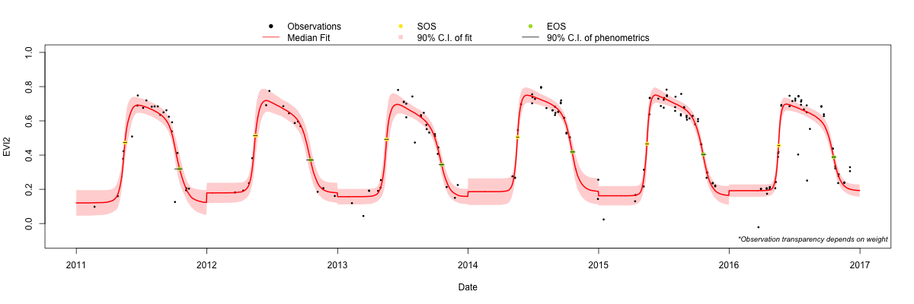

```{r, include = FALSE}
knitr::opts_chunk$set(
  eval=TRUE,
  collapse = TRUE,
  comment = "#>"
)
```


# Background
The code was originally developed by [Gao et al 2021](https://www.sciencedirect.com/science/article/pii/S0034425721002029?via%3Dihub), whose paper detailed a Bayesian hierarchical model to quantify land surface phenology from disparate, optical remote sensing time series. In other words, the model is able to take sparse vegetation index observations from the entirety of the Landsat time series (for example), and create a continuous estimate of annual land surface phenology. In addition to calculating start of season (SOS) and end of season (EOS) dates, the model also calculated pixel-wise uncertainty estimates for each of these phenometrics.

This vignette will walk you through the `blsp` package and how to use it. For the source code, please visit the [Github repository](https://github.com/ncsuSEAL/Bayesian_LSP).

# Running the code
## Set-up
As an example dataset, we will use the `landsatEVI2` dataset, which has EVI2 (two-band enhanced vegetation index, for more details, see  [here](https://en.wikipedia.org/wiki/Enhanced_vegetation_index)) data calculated from Landsats 5-8 from 1984-2019. For each measurement, there is a corresponding, boolean snow flag (to be used for assigning weights).
```{r laod-data}
library(blsp)
data(landsatEVI2)
```

## Fitting the model
At its core, all you need to run the main function (`FitBLSP`) is a vector of vegetation index data that follows a [double logistic function](https://www.desmos.com/calculator/rftz67g7eb) (e.g. NDVI, EVI, EVI2), and the corresponding dates of the individual data points. With these, running the code is simple. 

Here to save some computing time but show the power of the BLSP algorithm in handling data sparsity, we only use data from 1984 to 1994 to fit the model.
```{r fit-blsp}
sub_dt <- landsatEVI2[lubridate::year(date) %in% 1984:1994, ]
results <- FitBLSP(
  date_vec = sub_dt$date, 
  vi_vec = sub_dt$evi2, 
  opt = list(method = "threshold"),
  verbose = TRUE
)
```

The results are stored in an object with three elements. First, "phenos" is a table containing the estimated day of year (DOY) of "midgreenup"(or SOS) and "midgreendown" (or EOS) for each year contained in the sample data, along with upper and lower bounds. Second, "params" is a table containing the generated model parameter samples by the [Markov chain Monte Carlo (MCMC) sampling](https://en.wikipedia.org/wiki/Markov_chain_Monte_Carlo). Third, "data" is the input data table used to fit the BLSP algorithm.
```{r blsp-result-structure}
str(results)
```

Let's plot the reconstruction of the EVI2 time series using the supplied data. This will take a little time to run as the function will try each combination of the MCMC-generated parameters to predict the best fit curve.
```{r blsp-fit-figure, fig.width=7.5, fig.height=4}
fitted_dt <- PlotBLSP(results, if_return_fit = TRUE)
```

We see that "fitted_dt" is a data table with the information used to construct the plot.
```{r blsp-fitted-table}
head(fitted_dt)
```

### Changing weights
Some users may want to assign different weights to certain observations. For example, perhaps the QA for several days is bad and we want to downweight those observations such that they contribute less to the posterior distribution. To do so, we supply a vector of equal length to `vi_vec` in the range [0,1]. In the sample data, the `snow` column indicates the presence of snow for the corresponding dates. Here, we will assign weights of 0.1 to those observations. (Again, we only use data from 1984 to 1994 as an example)
```{r assign-weights}
sub_dt <- landsatEVI2[lubridate::year(date) %in% 1984:1994, 
  .(date, evi2, weights = ifelse(snow, 0.1, 1), snow)
]
head(sub_dt)
```

Adding in weights will make the code run longer. The reason is that the downweighted observations can make the data more sparse than it already is (e.g., if some points have weight near 0, they would contribute little information), thus the Bayesian model may need more time to converge.

Compare the first few rows of "phenos" below with the previous results above.
```{r blsp-with-weights}
results <- FitBLSP(
  date_vec = sub_dt$date, 
  vi_vec = sub_dt$evi2, 
  weights_vec = sub_dt$weights,
  verbose = TRUE
)
head(results$phenos)
```


### Assigning initial values
As documented in [Gao et al 2021](https://www.sciencedirect.com/science/article/pii/S0034425721002029?via%3Dihub), good initial values can save some time for the model to converge. By default, the `initValues` of the `FitBLSP()` function are determined by the BLSP model so the users don't have to provide them. But if you want, we *can* get initial values from fitting an average model in which all years of data are pooled together. However, there is some risk with this, as the average model inherently can't successfully fit all time series data (that's one of the reasons that we need the BLSP model!). If you try obtaining initial values using `FitAvgModel` with your data and it fails, then we suggest simply running `FitBLSP()` with the default `initValues` argument of `NULL`.

```{r fit-avg-model}
avg_fit <- FitAvgModel(sub_dt$date, sub_dt$evi2)
print(avg_fit)
```

The average model can also be plotted out:
```{r avg-fit-figure, fig.width=7, fig.height=5}
par(mar = c(3, 3, 1, 1))
PlotAvg(
  date_vec = sub_dt$date,
  vi_vec = sub_dt$evi2,
  avg_fit = avg_fit
)
```

Returning to `FitBLSP()`, the `iniValues` argument can either be a numeric vector or an object returned by the `FitAvgModel()` function. Here we will use the latter. 
```{r blsp-with-initVal}
results <- FitBLSP(
  date_vec = sub_dt$date, 
  vi_vec = sub_dt$evi2, 
  init_values = avg_fit,
  verbose = TRUE
)
```

We can then see the result of the fit:
```{r blsp-result}
str(results)
```


## Processing BLSP for your own data
If you have your own data you want to use this package for, that's great! Otherwise, we've provided a simple way for users to obtain EVI2 time series data for their area(s) of interest via Google Earth Engine (GEE) and Microsoft Planetary Computer (MPC). Here we are using Landsats 5,7,8,9 Collection 2 Surface Reflectance data. **Note this method requires you have a Google account**.


### Get data from Microsoft Planetary Computer
Getting EVI2 time series using Microsoft Planetary Computer (MPC) is easy by using the functions we provide, you don't need to register an account, and you can do it in the R environment so it's good for keeping you code consistent. But, keep in mind that since PC is relatively new, the API may change which would make our functions throw errors in the future. Also, note that running the code in this section is going to take a while, so in the vignette, we only put the example code and the corresponding results rather than running the code each time you install the library. It will save some time, but the result may be different from what you get.

To get EVI2 time series from MPC, you need to have point locations specified by longitude and latitude. Although our functions only do one point location at a time, you can do multiple points in a loop.

```{r mpc-point-loc, eval = FALSE}
# A point location specified by long/lat format
# You MUST name the coordinates with `x` and `y` and put them into a data.frame
pt_coords <- data.frame(x = -71.700975, y = 43.945733)
```

Then, you can specify the temporal period by a character string. And, since we use parallel procesing to process the data, you may specify the number of cores you want to use for parallel. **Note that for processing speed, here in the example we are getting data for 6 years, as we know the BLSP model borrows information from other years, doing 6 years could yield relatively large uncertainty on the estimate depending on the data sparsity. So, once you are sure the code runs well on your machine, do multiple tests on the data side.** 

```{r mpc-focal-dates, eval = FALSE}
# Use the format of "start_date/end_date"
focalDates <- "2011-01-01/2016-12-31"

# Number of cores
ncores <- 10
```

To get the data, you can use `GetEvi2PointTs()` function (it's going to take around 5 minutes for the function to prepare the data, depending on how long the requested temperal period is and the internet speed).

```{r mpc-get-data, eval = FALSE}
evi2_dt <- GetEvi2PointTs(
  pt_coords = pt_coords,
  focalDates = focalDates,
  ncores = ncores
)
```

After the code is done, you can see the result in the `evi2_dt` object (note that we did not remove values with snow):
```{r mpc-evi2-ts, eval = FALSE}
head(evi2_dt)
```

```
   img_id                          lon       lat      evi2      date       qa    snow
1: LT05_L2SP_013029_20100109_02_T1 -71.70097 43.94573 0.1000716 2010-01-09 13600  TRUE
2: LT05_L2SP_012030_20100307_02_T1 -71.70097 43.94573 0.1410364 2010-03-07  5440 FALSE
3: LT05_L2SP_013029_20100415_02_T1 -71.70097 43.94573 0.1754859 2010-04-15  5440 FALSE
4: LE07_L2SP_013029_20100423_02_T1 -71.70097 43.94573 0.2231386 2010-04-23  5440 FALSE
5: LT05_L2SP_012030_20100424_02_T1 -71.70097 43.94573 0.2273574 2010-04-24  5440 FALSE
6: LT05_L2SP_012030_20100510_02_T1 -71.70097 43.94573 0.5618129 2010-05-10  5440 FALSE
```

Once you get the EVI2 time series, you can process BLSP from the data as usual. The code might run for several minutes depending on the number of years in the time series.

```{r mpc-blsp, eval=FALSE}
# Remove snow
evi2_dt <- evi2_dt[snow == FALSE, ]

# Fit the average model
avg_fit <- FitAvgModel(
  date_vec = evi2_dt$date,
  vi_vec = evi2_dt$evi2
)

# Fit the BLSP model
results <- FitBLSP(
  date_vec = evi2_dt$date,
  vi_vec = evi2_dt$evi2,
  init_values = avg_fit,
  verbose = TRUE
)
```

And plot out the model fit:
```{r mpc-plot-blsp, eval=FALSE}
png("mpcResults.png", width=1200, height=400)
fitted_dt <- PlotBLSP(results, if_return_fit = TRUE)
dev.off()
```




### Get data from GEE
First, please go to [this link](https://code.earthengine.google.com/7e2cdb594772506e296bda8411b05d20) for the GEE script. If the link does not work, please open a new [code browser](https://code.earthengine.googlecom) and copy/paste the script found [here](https://github.com/ncsuSEAL/Bayesian_LSP/blob/main/gee/getSampleData.js).

Second, change the start and end dates (*Section 1: Define variables*) and the point coordinates (*Section 1: Define study locations*) as you need, and run the script by clicking the "Run" button.

Third, go to "Tasks" panel, and click the "RUN" button in the row of the "exportEVI2" task. It will open a window with the detailed information including task name, export directory (has to be a Google Drive folder), export file name, and file type. We will use the default setting for this vignette. Click the "RUN" button of the window. 

It might take several minutes for GEE to process the time series depending on the current availability of their cloud computing resource. After it's done, the exported time series data file should be in your Google Drive folder. 

### Apply BLSP to GEE data

Note: we don't have this GEE data included in our package as standalone data. Instead, here we are showing the code as if we are loading from a local directory after downloading from GEE. Because of this, any outputs shown here are from us running the code then manually adding the results to each section.

In R, load in the time series data file by:
```{r gee-data, eval=FALSE}
library(data.table)
sample_data <- fread("sampleData.csv")
```
Using `head(sample_data)`, you will see it has 7 columns containing information of sensor type, date, longitude, latitude, point id, EVI2 value, and pixel QA value. 
```{r, ex1}
#                satellite       date      lon       lat id      evi2 QA_PIXEL
# 1: LANDSAT/LT05/C02/T1_L2 1991-10-29 43.94573 -71.70097  0        NA       NA
# 2: LANDSAT/LT05/C02/T1_L2 1991-10-29 43.95202 -71.72556  1        NA       NA
# 3: LANDSAT/LT05/C02/T1_L2 1991-10-29 43.95092 -71.72874  2        NA       NA
# 4: LANDSAT/LT05/C02/T1_L2 1991-10-29 43.95895 -71.73166  3 0.1578591     5440
# 5: LANDSAT/LT05/C02/T1_L2 1991-10-29 43.94913 -71.73183  4        NA       NA
# 6: LANDSAT/LT05/C02/T1_L2 1991-10-29 43.95740 -71.73687  5        NA       NA
```

To run the BLSP model, let's select a single time series and omit all `NA` rows (important!).
```{r single-ts, eval=FALSE}
# Select one single time series
single_ts <- sample_data[id == 1, .(date, evi2)]

# Remember to remove NA rows before running the `blsp` package
single_ts <- na.omit(single_ts)
head(single_ts)

#         date      evi2
# 1: 1984-06-19 0.7871580
# 2: 1984-09-23 0.5792558
# 3: 1985-06-22 0.7871400
# 4: 1985-08-09 0.7356111
# 5: 1985-10-12 0.4650306
# 6: 1986-06-09 0.7066563
```

Now, we can use the `blsp` package as usual. This code chunk might run for several minutes depending on how many years are in the time series.
```{r fit-gee-data, eval=FALSE}
# Fit the average model
avg_fit <- FitAvgModel(
  date_vec = single_ts$date,
  vi_vec = single_ts$evi2
)

# Fit the BLSP model
results <- FitBLSP(
  date_vec = single_ts$date,
  vi_vec = single_ts$evi2,
  init_values = avg_fit,
  verbose = TRUE
)
```

Plot out the model fit:
```{r plot-blsp-gee-data, eval=FALSE}
png("geeResults.png", width=1200, height=400)
fitted_dt <- PlotBLSP(results, if_return_fit = TRUE)
dev.off()
```


If you encounter any issues while using the package, please feel free to [leave us an issue on Github](https://github.com/ncsuSEAL/Bayesian_LSP).


